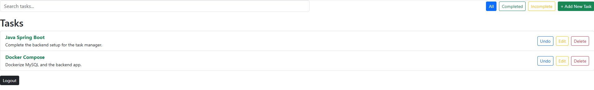
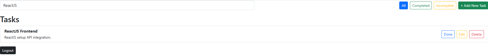
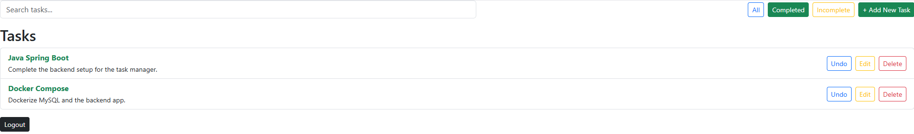
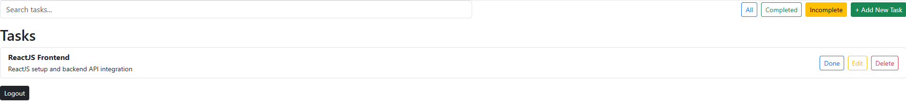
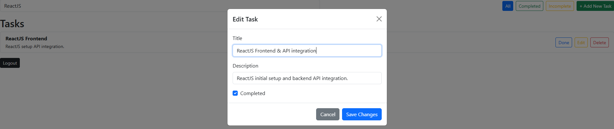
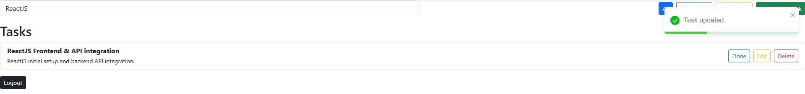
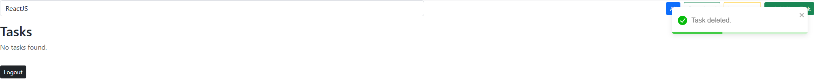
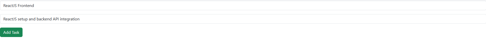
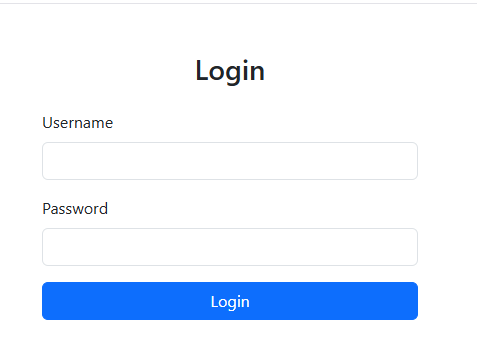

# 📝 Task Manager Web App

A simple task management application built with **ReactJS** (frontend) and **Spring Boot** (backend) that allows users to:

- View a list of tasks
- Add, edit, delete, and mark tasks as completed
- Filter tasks (All, Completed, Incomplete)
- Search tasks by title or description
- Secure access using JWT authentication

---

## 🚀 Features

✅ View and search tasks  
✅ Add new task with title and description  
✅ Edit task with modal popup  
✅ Mark tasks as completed/incomplete  
✅ Delete tasks  
✅ Filter tasks (All, Completed, Incomplete)  
✅ JWT-based login/logout flow  
✅ Mobile-friendly responsive UI (Bootstrap)

---

## 📦 Technologies Used

**Frontend**  
- ReactJS
- React Router
- Axios
- React Toastify
- Bootstrap 5

**Backend**  
- Spring Boot (Java)
- Spring Security (JWT authentication)
- MySQL database

**DevOps**  
- Docker & Docker Compose

---

## 📂 Project Structure
task-manager-web/
├── public/
├── src/
│ ├── components/
│ │ ├── LoginForm.js
│ │ ├── TaskList.js
│ │ └── TaskForm.js
│ ├── services/
│ │ ├── AuthService.js
│ │ └── TaskService.js
│ ├── App.js
│ └── index.js

---

## 🛠 Running Frontend in Development
Install dependencies:

```bash
npm install
```

Start the React app:

```bash
npm run start
```
Make sure the backend (Spring Boot) is running on localhost:8080.

--- 

## 🔐 Authentication
JWT is stored in localStorage after login.

Requests to protected endpoints include the token in the Authorization header.

If the token is missing or invalid, users are redirected to the login page.

---

## 📸 UI Preview
Feature	Screenshot
Task List	✅ Shows title, description, complete status



Task Filter	✅ All / Completed / Incomplete







Task Actions	✅ Edit, Delete, Mark Done







Add Task	✅ Form routed via React Router



Login	✅ JWT secured login page


